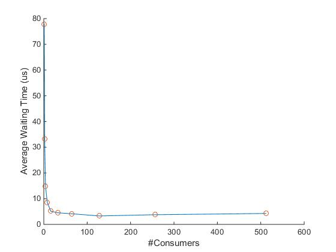
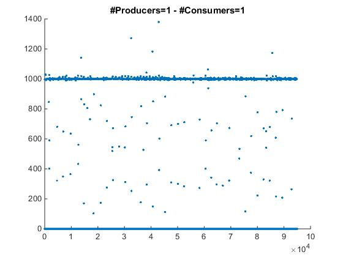
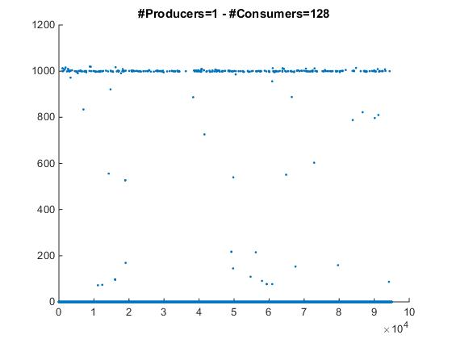

# Embedded and Real-Time Systems - Assignment 1

This is a report regarding the first assignment of "Embedded and Real-Time Systems" in EE, Auth.

In this assignment, we were called to modify an implementation of the ***Producer-Consumer Problem*** with the use of the *pthead* API. We had to modify the **common queue** and introduce **multiple** ***producers/consumers*** that whould all work in parallel, depositing and retrieving items from the queue.

The most significant part of our task however, was to examine how the number of *producers/consumers* affects the performance of our program and, more specifically, the time interval between the deposition and the retrieval of the items in the queue.

These days, the necessity for parallel programming is larger than ever, since the amount of data being processed is increasing rapidly. Multiprocessors have a sole purpose of the gratification of exactly this need.So, **effective communication between processes** has never been more important. The optimization of the Producer-Consumer problem is imperative, as it is a direct implementation of this commuication and it is being used very frequently.

We ran the modified program many times and changed the number of consumers interacting with the queue of items, in order to find out which one was the best in terms of "waiting in queue" time. 

Specifiacly we ran a loop of 10000 deposits with:
* 1 consumer
* 2 consumers
* 4 consumers
* 8 consumers
* 16 consumers
* 32 consumers
* 64 consumers
* 128 consumers
* 256 consumers
* 512 consumers

The mean interval time of the different rounds is displayed in the graph below:

As we can see the mean interval time is greatly reduced as the number of concumers is being increased. However, we can notice a slight incline of the graph after the ***128*** consumer mark. This makes as conclude that around 100 consumers is the optimal number for fastest item retrieval. Of course, in different work-stations, the results may differ. But we can say with certainty that larger numbers of consumers should be preferred. In the scatter plots below we can observe where the majority of instanses is concertrated.

Of course, you can find the full code and the rest of the graphs [here](https://github.com/dimitris2ks/Embedded_RealTime_1_9672.git) .

Dimitrios Xylogiannis, 9672